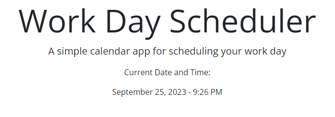
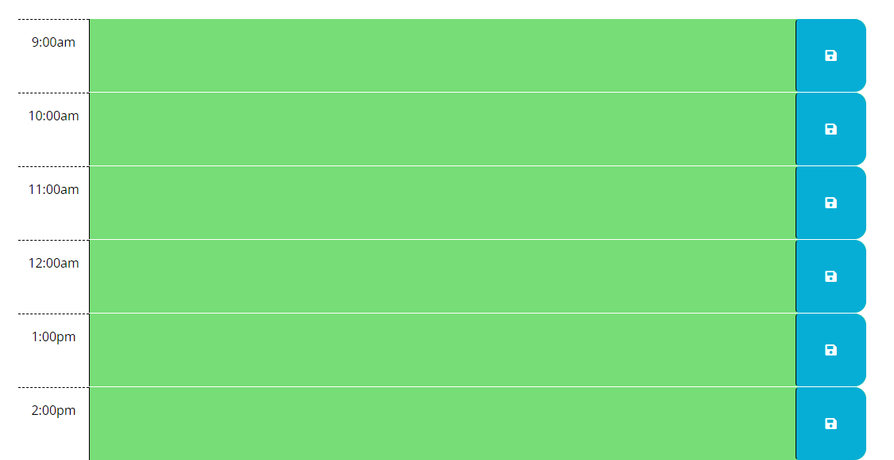
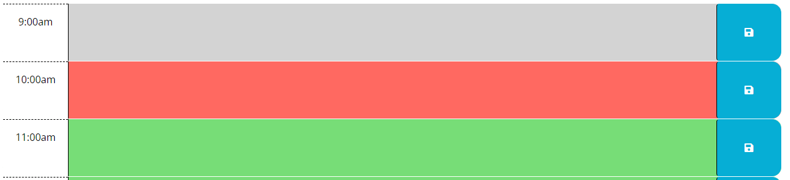

Welcome to my Day Work Scheduler!

On the main page youll see the title and the current date and time!

 

The body of the page will show the timestamps throughout the day!

Boxes have color codes based on the past(gray) present(red) future(green)

To save a task simply type your task in the box and make sure to click the save button when your finished!

To delete a task make sure to delete the text and save the empty text block!

Thanks so much for viewing my project!